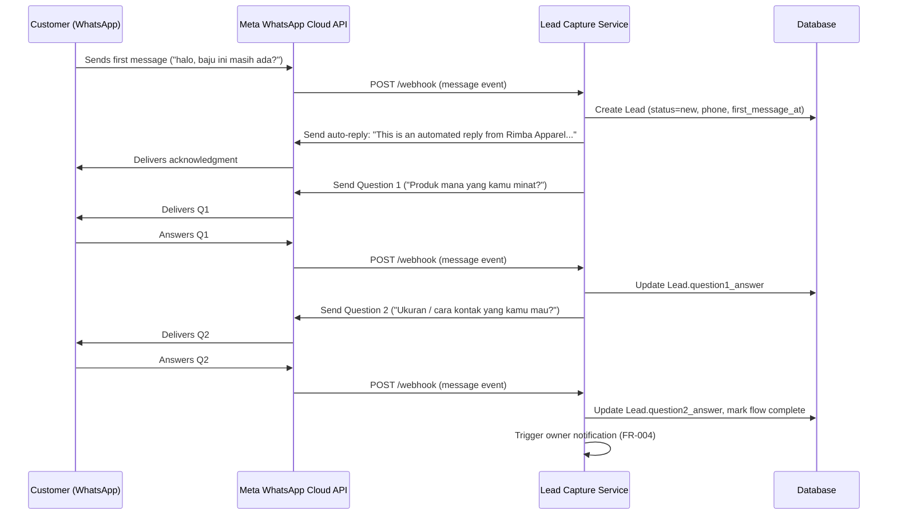
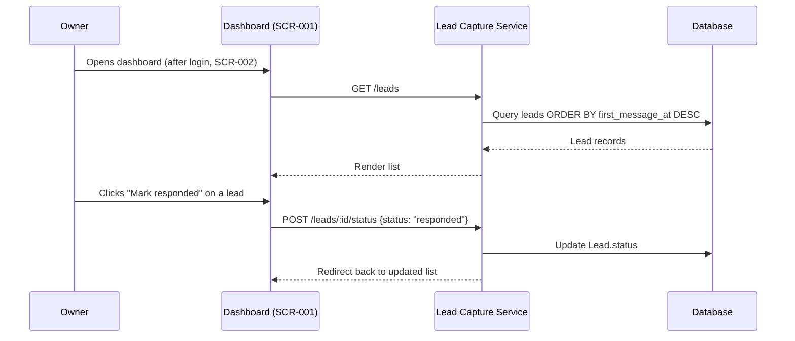
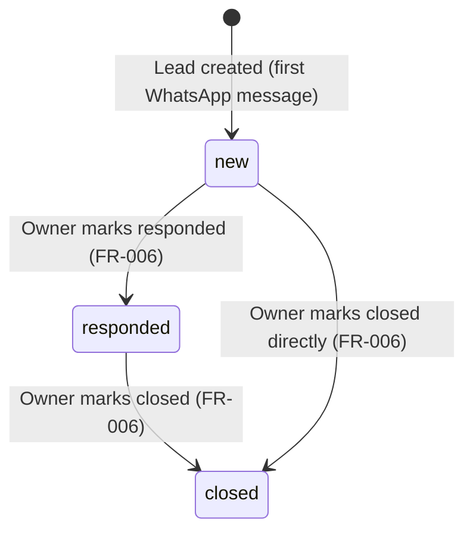

# Technical Design — WhatsApp Lead Capture & Auto-Responder

Covers Phase H (UX/workflow), Phase I (architecture), Phase J (stack selection), Phase K (data model), Phase L (API contracts). Builds directly on `../changes/2026-09-01-whatsapp-lead-capture.md` (approved scope) — nothing here contradicts that file's FR/NFR/out-of-scope.

---

## Phase H — UX and Workflow Design

### Workflow 1: New Lead Capture via WhatsApp (the core workflow — FR-001 to FR-003, FR-007, FR-008)



**Happy Path:** exactly as above — both questions answered in order.
**Error Path:** WhatsApp Cloud API returns a delivery failure when sending a reply → the service logs a `failed_events` record (NFR-002) instead of retrying silently forever; the Lead record still exists with whatever data was captured so far.
**Empty State:** not applicable to WhatsApp itself; the *dashboard's* empty state is "No leads yet — once a customer messages your WhatsApp number, they'll show up here."
**Loading State:** not applicable to the WhatsApp side (async messaging); dashboard shows a simple loading indicator only if the lead list takes longer than expected to render (unlikely at this scale, but the state is defined for completeness).
**Success State:** customer receives Q1 and Q2 acknowledgment; a fully answered Lead exists in the dashboard with status `new`.
**Fallback Path (FR-007):** customer sends something that isn't a recognizable answer to the current question (e.g., a new unrelated question, or silence followed by a different message) → service sends "Thanks — a team member will follow up with you shortly," and the Lead is still created/updated with whatever was captured, status stays `new`.

### Workflow 2: Owner Reviews & Updates Lead Status (FR-005, FR-006)



**Happy Path:** as above.
**Error Path:** owner tries to update a lead ID that doesn't exist (stale page) → service returns a 404 with a plain-language flash message ("This lead no longer exists"), list reloads correctly.
**Empty State:** "No leads yet" message with a one-line explanation of what will appear here (see Workflow 1).
**Loading State:** simple server-rendered page — no client-side spinner needed at this scale (avoids overengineering per Phase I guidance).
**Success State:** updated status visible immediately in the list after redirect.

### Screen Inventory

| ID | Screen | Purpose | Primary User Action | Data Displayed | States | Reusable Components |
|---|---|---|---|---|---|---|
| SCR-001 | Lead Dashboard | Let the owner see and manage captured leads (US-003, US-005, US-006) | Mark a lead responded/closed | Phone number, first message time, Q1/Q2 answers, status | empty / populated / error (stale ID) | Lead row/status badge |
| SCR-002 | Login | Protect lead data (customer phone numbers) from public access (NFR-003) | Enter password | — | idle / invalid-credentials | Login form |

No other screens are created — a "settings" screen for the qualifying-question config is intentionally **not** built as a UI (NFR-005 is satisfied by an editable config file, not a screen), since a UI here would be scope not justified by any user story.

---

## Phase I — Technical Architecture

### Architecture Overview

A single small backend service handles both the WhatsApp webhook (public-facing, called by Meta) and the owner-facing dashboard (authenticated). One process, one database, no message queue, no microservices — justified by the actual scope (single business, low message volume, one integration target). This is a deliberate choice, not a shortcut: over-architecting a lead-capture tool for a 2-person business would itself be a red flag in a freelance portfolio review.

### Frontend
Server-rendered HTML (EJS templates) for SCR-001/SCR-002. No SPA framework — the dashboard is a simple list + status buttons, and a client-side framework would add build complexity with no user-facing benefit (violates Phase I's "do not overengineer" instruction and NFR-004's plain-usability requirement).

### Backend
Node.js + Express. Handles the WhatsApp webhook verification/receipt, the qualifying-question state machine, and serves the dashboard routes.

### Database
SQLite (via `better-sqlite3`), single file. Appropriate for the actual data volume of a 2-person business's leads, zero external infra to provision, and trivially portable for a demo.

### External Services
Meta WhatsApp Business Cloud API (Graph API) — the only external dependency, matching the Entry Service's actual technical capability requirement from `portfolio-strategy.md`.

### API Boundaries
- **Inbound:** `POST /webhook` — Meta calls this, unauthenticated at the transport level but validated via Meta's webhook signature header (`X-Hub-Signature-256`).
- **Outbound:** Express service calls Meta's Graph API to send messages (Bearer token auth via a system access token, not a per-user flow).
- **Internal:** dashboard routes (`GET /leads`, `POST /leads/:id/status`) are session-authenticated, not part of any public API surface.

### Authentication Strategy
Needed — the dashboard displays customer phone numbers (NFR-003). Simple single-owner session login: one username/password pair stored via environment variables, session cookie on successful login. No user registration flow, no OAuth — a full auth system would be scope not justified by a single-owner tool.

### Authorization Strategy
Not needed beyond "logged in or not" — there is exactly one user role (the owner). Multi-user roles are explicitly out of scope (see `changes/2026-09-01-whatsapp-lead-capture.md`, NEVER FOR THIS PROJECT).

### Data Flow
Meta → `POST /webhook` → signature verification → message-type routing (first message vs. Q1 answer vs. Q2 answer vs. fallback) → Lead create/update → reply sent back to Meta → (on new Lead) owner notification flag set → dashboard reads Lead table on each page load.

### Error Handling
Every webhook processing attempt is wrapped so a failure (DB error, Meta API error, malformed payload) is caught, written to a `failed_events` table with the raw payload and error message, and the webhook still returns `200 OK` to Meta (Meta will otherwise retry the same event repeatedly, which would create duplicate leads — this is TD-004 below). The `failed_events` table is what makes NFR-002 ("logged and does not silently drop") concretely verifiable in a demo, not just a claim.

### Logging
Structured console logging (timestamp, event type, lead ID where applicable, outcome) — sufficient for a project this size; no external log aggregation service, which would be disproportionate infrastructure for a 2-person business's tool.

### Testing Strategy
- Unit tests: qualifying-question state machine (given a Lead's current state and an inbound message, what's the next action) and fallback detection logic — this is the actual business logic worth protecting.
- Integration test: simulate a Meta webhook payload end-to-end against a test database, assert the correct Lead record and reply content.
- Manual verification: real round-trip against a Meta WhatsApp test number, since full Graph API behavior can't be meaningfully mocked for a demo without misrepresenting what was actually verified.

### Deployment Strategy
Single-service deployment to a low-cost PaaS (e.g., Railway/Render) with the SQLite file on a persistent volume. No containersorchestration, no multi-region — proportionate to a 2-person business's budget and the demo's purpose. This proportionality is itself part of the sales story (Anti-USP from Phase 2: don't compete on unnecessary sophistication).

### Technical Decisions

**TD-001 — Backend framework: Express (Node.js)**
- Alternatives considered: FastAPI (Python), a no-code tool (n8n) wired to a simple UI.
- Reason: Node/Express keeps the whole system (webhook + dashboard) in one small, readable codebase; matches the JS-centric tooling (n8n, Zapier code steps) most small-business automation postings reference in Phase 1 research, which is directly relevant when explaining the build to a prospective client.
- Trade-off: Python/FastAPI would be equally valid technically; Node was chosen for freelance-market narrative fit, not technical superiority — worth being explicit about in the case study.

**TD-002 — Database: SQLite**
- Alternatives considered: Postgres, Airtable (no-code).
- Reason: zero infrastructure to provision for a single-business tool at this data volume; trivially portable for a live demo.
- Trade-off: would not scale to Project 2/3's multi-source, higher-volume needs — intentionally revisited in Project 2's own technical design rather than over-provisioned here.

**TD-003 — Dashboard rendering: server-rendered EJS, not a SPA**
- Alternatives considered: React/Next.js dashboard.
- Reason: the dashboard is a single list + status toggle; a SPA framework adds build tooling and client-state complexity with no corresponding user benefit, and directly conflicts with the "do not overengineer" instruction.
- Trade-off: less visually polished out of the box than a component-library-based UI; acceptable since NFR-004 asks for plain usability, not visual sophistication.

**TD-004 — Webhook always returns 200, failures logged separately**
- Alternatives considered: return a 4xx/5xx on internal failure so Meta retries automatically.
- Reason: Meta's retry behavior on non-200 responses would resend the same message event, risking duplicate Lead records or duplicate replies to the customer — worse than a logged, non-retried failure.
- Trade-off: a failure is not auto-recovered; it depends on the `failed_events` log being reviewed (acceptable at this scale, and it's the literal proof point for the "monitored integration" USP).

---

## Phase J — Tech Stack Selection Summary

| Technology | Why Chosen | Why Not a Simpler Option | Client Problem It Helps Solve |
|---|---|---|---|
| Node.js + Express | Small, readable, matches the JS-centric small-business automation ecosystem referenced throughout Phase 1 research | Already about as simple as a real webhook service gets; a no-code tool (n8n) was considered but doesn't produce a demonstrable owned codebase for a freelance portfolio | Needs a reliable place to receive and process WhatsApp events |
| SQLite | Zero infrastructure, proportional to actual data volume | N/A — this *is* the simpler option, chosen deliberately over Postgres | Needs lead data to persist somewhere durable without added hosting cost |
| Server-rendered EJS | Matches NFR-004 (plain usability), avoids SPA build complexity | N/A — deliberately the simpler option over React/Next.js | Owner needs to see leads without any technical setup on their side |
| Meta WhatsApp Cloud API (official) | The only channel the client actually uses; "official API" is itself part of the Entry Service's differentiation (Phase 2 Offer 1) | An unofficial/third-party WhatsApp library was explicitly rejected — risks the client's WhatsApp number being banned, which Phase 2 identifies as the exact mistake this positioning avoids | Directly solves the core problem: instant, safe, automated WhatsApp response |

---

## Phase K — Data Model

### Entities

**Lead**
| Field | Type | Constraint |
|---|---|---|
| id | integer | primary key, autoincrement |
| phone_number | text | required, non-empty |
| first_message_at | datetime | required |
| question1_answer | text | nullable |
| question2_answer | text | nullable |
| status | text | required, enum: `new`, `responded`, `closed`; default `new` |
| fallback_triggered | boolean | default false (set true when FR-007 fallback fires) |
| created_at | datetime | required, default now |
| updated_at | datetime | required, default now, updated on any change |

**FailedEvent**
| Field | Type | Constraint |
|---|---|---|
| id | integer | primary key, autoincrement |
| raw_payload | text (JSON) | required |
| error_message | text | required |
| occurred_at | datetime | required, default now |

### Relationships
None — both entities are independent single tables. No join tables, no foreign keys are needed at this scope (a `Lead` does not reference a `FailedEvent`; a failed event is a standalone diagnostic record).

### Lifecycle States (Lead.status)



### Validation Rules
- `phone_number` must be non-empty and match a plausible phone format (digits, optional leading `+`); reject-and-log (as a FailedEvent) if Meta ever sends a malformed value.
- `status` must be one of the three enum values; any other value is rejected at the application layer before it reaches the database (defense against a stale/buggy client request).
- `question1_answer` / `question2_answer` are nullable — a Lead can legitimately exist with only a first message and no completed answers (matches FR-007's fallback path).

---

## Phase L — API and System Contracts

### `GET /webhook` (WhatsApp verification handshake — required by Meta)
- **Request:** query params `hub.mode`, `hub.verify_token`, `hub.challenge`
- **Response (200):** plain text body = `hub.challenge` value, only if `hub.verify_token` matches the configured secret
- **Response (403):** if the token doesn't match
- **Validation:** exact string match against an environment-configured verify token
- **Authorization:** token-based, per Meta's own verification protocol (no session/user auth applies here)

### `POST /webhook` (inbound WhatsApp message event)
- **Request (example payload, abbreviated to the relevant fields):**
```json
{
  "entry": [{
    "changes": [{
      "value": {
        "messages": [{
          "from": "6281234567890",
          "timestamp": "1735689600",
          "text": { "body": "halo, baju ini masih ada?" }
        }]
      }
    }]
  }]
}
```
- **Response (200):** `{ "status": "received" }` — always returned, even on internal processing failure (see TD-004)
- **Validation:** verify `X-Hub-Signature-256` header against the app secret before processing; malformed/unverifiable payloads are logged to `FailedEvent` and still acknowledged with 200
- **Error Responses:** none surfaced to Meta by design (TD-004); internal failures are visible only via `FailedEvent` records
- **Authorization:** Meta webhook signature verification (not a user session)

### `GET /leads` (dashboard — SCR-001)
- **Request:** authenticated session required (redirect to `/login` if absent)
- **Response (200):** rendered HTML listing leads, most recent first, with status and both answers
- **Validation:** none beyond session check
- **Error Responses:** `401` → redirect to `/login`
- **Authorization:** session cookie (single-owner login)

### `POST /leads/:id/status`
- **Request:** `{ "status": "responded" | "closed" }`, authenticated session required
- **Response (200):** redirect to `/leads` with updated state visible
- **Validation:** `id` must reference an existing Lead; `status` must be one of the two allowed values (an update to `new` is not a valid user action, since that's the system-assigned initial state)
- **Error Responses:** `404` if `id` doesn't exist (plain-language flash message per Workflow 2's error path); `400` if `status` is invalid
- **Authorization:** session cookie (single-owner login)

### `POST /login`, `GET /login` (SCR-002)
- **Request:** `{ "username": string, "password": string }`
- **Response (200):** sets session cookie, redirects to `/leads`
- **Response (401):** invalid credentials, re-renders login form with an error message
- **Validation:** credentials checked against environment-configured values (no user table — single owner)
- **Authorization:** n/a (this endpoint establishes the session)
